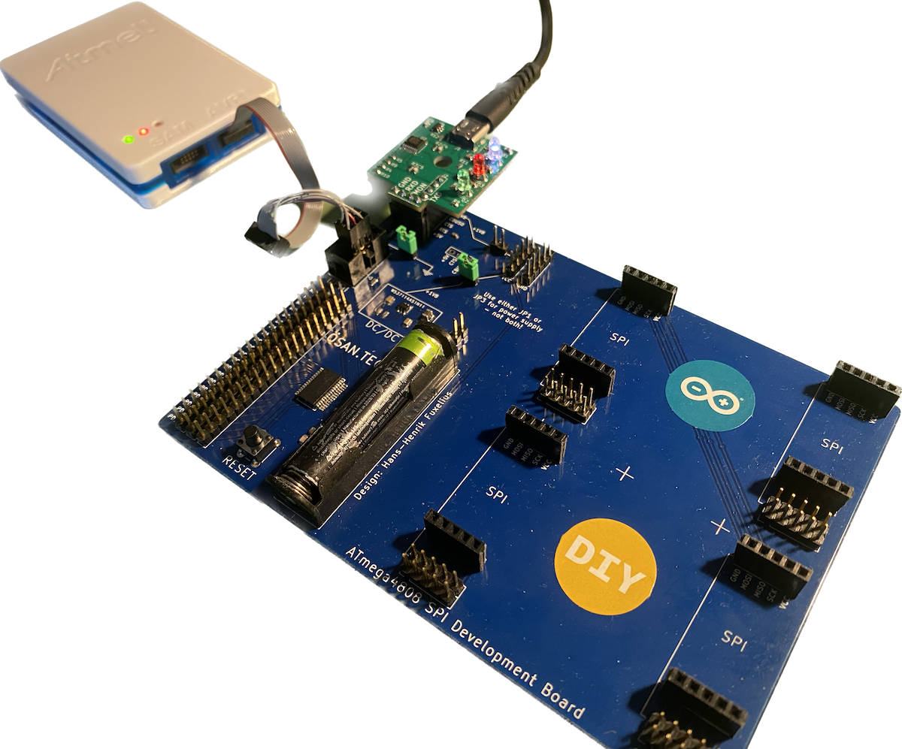
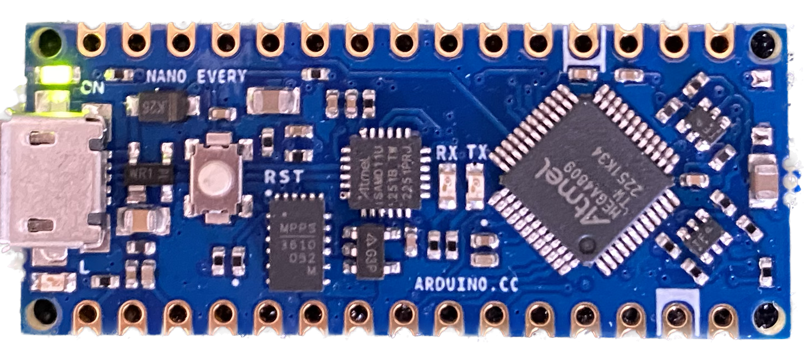

# Interrupt driven and buffered UART for tiny- and megaAVR
This UART library is loosely based on a technical brief article from Microchip [TB3216](https://ww1.microchip.com/downloads/en/Appnotes/TB3216-Getting-Started-with-USART-DS90003216.pdf)
and I have tried to follow it as close as possible in functionality and naming conventions.  It is general enough to be adapted for any UARTn (supports up to 6 USARTs depending on MCU).   The library size compiled is **~900 bytes** with one USART used and without *fprintf*. It is **~2700 bytes** with the library for *fprintf* added. The code is more or less self-explanatory. Where issues may arise I have tried to comment it sparingly.

It was initially developed for a [bare metal atmega4808](https://github.com/fuxelius/atmega4808_bare_metal) project and the structure in the repository reflect this heritage. If  you use the ATmega4808 and USART0 it will compile out of the box, otherwise some settings must be done before it works. The setup process will be oulined below.

**P.S.** As a convenience for you to rapidly test and evaluate this library I have also [adapted it ](https://github.com/fuxelius/atmega_avr_uart_nano_every) to the Arduino Nano Every with an ATmega4809 MCU. The setup for how to compile is detailed in [C Programming for 'Arduino Nano Every' Board (ATmega4809) with a Mac and VS Code](https://github.com/fuxelius/nano_every_bare_metal#c-programming-for-arduino-nano-every-board-atmega4809-with-a-mac-and-vs-code)

## Intended devices

**megaAVR 0-series**: which consists of ATmega808, ATmega809, ATmega1608, ATmega1609, ATmega3208, ATmega3209, ATmega4808 and ATmega4809.

**tinyAVR 0-series**: ATtiny202, ATtiny402, ATtiny204, ATtiny404, ATtiny804, ATtiny1604, ATtiny406, ATtiny806, ATtiny1606, ATtiny807 and ATtiny1607

**tinyAVR 1-series**: ATtiny212, ATtiny412, ATtiny214, ATtiny414, ATtiny814, ATtiny1614, ATtiny416, ATtiny816, ATtiny1616, ATtiny3216, ATtiny417, ATtiny817, ATtiny1617 and ATtiny3217 

**AVR DA devices**: AVR32DA28, AVR64DA28, AVR128DA28, AVR32DA32, AVR64DA32, AVR128DA32, AVR32DA48, AVR64DA48, AVR128DA48, AVR64DA64, AVR128DA64

## Setting up parameters

### Buffer size
The buffer size is symmetric and equal for both transmit (Tx) and receive (Rx). It has a typical size of 32 or 64, but can be set at any size in its range from 2, 4, 8, 16, 32, 64, 128 or 256. 

	define RBUFFER_SIZE 64

### PORTMUX - Port Multiplexer
The Port Multiplexer (PORTMUX) can either enable or disable the functionality of the pins, or change between default and alternative pin positions. Available options are described in detail in the PORTMUX register map and depend on the actual pin and its properties. Select which ever is appropriate for your selection of USARTn and pin selection. [Datasheet ss. 139]

	PORTMUX.USARTROUTEA = 0b01111111; // Set PB04, PB05

Above example is port multiplexing for pin PB04 and PB05 for USART3 as given in the USART library given for Arduino Nano Every. [Datasheet ss. 143]

## UART functions
    void usart0_init(uint16_t baud_rate);
    void usart0_send_char(char c);
    void usart0_send_string(char* str, uint8_t len);
    uint16_t usart0_read_char(void);
    void usart0_close(void);

## How to use the library
Here is a short overview of how to use the library. 

    // (1) - Init UART
    usart0_init((uint16_t)BAUD_RATE(9600));

    // (2) - Enable global interrupts
    sei(); 

    // (3) - Send string to UART
    usart0_send_string("\r\n\r\nPEACE BRO!\r\n\r\n", 18);

    // (4) - Use printf to write to UART
    fprintf(&USART0_stream, "Hello world!\r\n");

    for(uint8_t i=0; i<5; i++) {
        // (5) - Use formatted printf to write to UART
        fprintf(&USART0_stream, "\r\nCounter value is: 0x%02X ", j++);
        _delay_ms(500);

        // (6) - Get UART input by polling ringbuffer
        while(!((c = usart0_read_char()) & UART_NO_DATA)) {

            if (c & UART_PARITY_ERROR) {
                fprintf(&USART0_stream, "UART PARITY ERROR: ");
            }
            if (c & UART_FRAME_ERROR) {
                fprintf(&USART0_stream, "UART FRAME ERROR: ");
            }
            if (c & UART_BUFFER_OVERFLOW) {
                fprintf(&USART0_stream, "UART BUFFER OVERFLOW ERROR: ");
            }

            // (7) - Send single character to UART
            usart0_send_char((char)c);
        }
    }

    // (8) - Check that everything is printed before closing UART
    fprintf(&USART0_stream, "\r\n\r\n<-<->->");

    // (9) - Close UART0
    usart0_close();    

    // (10) - Clear global interrupts
    cli();

### (1) - Init UART

### (2) - Enable global interrupts

### (3) - Send string to UART

### (4) - Use printf to write to UART

### (5) - Use formatted printf to write to UART

### (6) - Get UART input by polling ringbuffer

### (7) - Send single character to UART

### (8) - Check that everything is printed before closing UART

### (9) - Close UART0

### (10) - Clear global interrupts